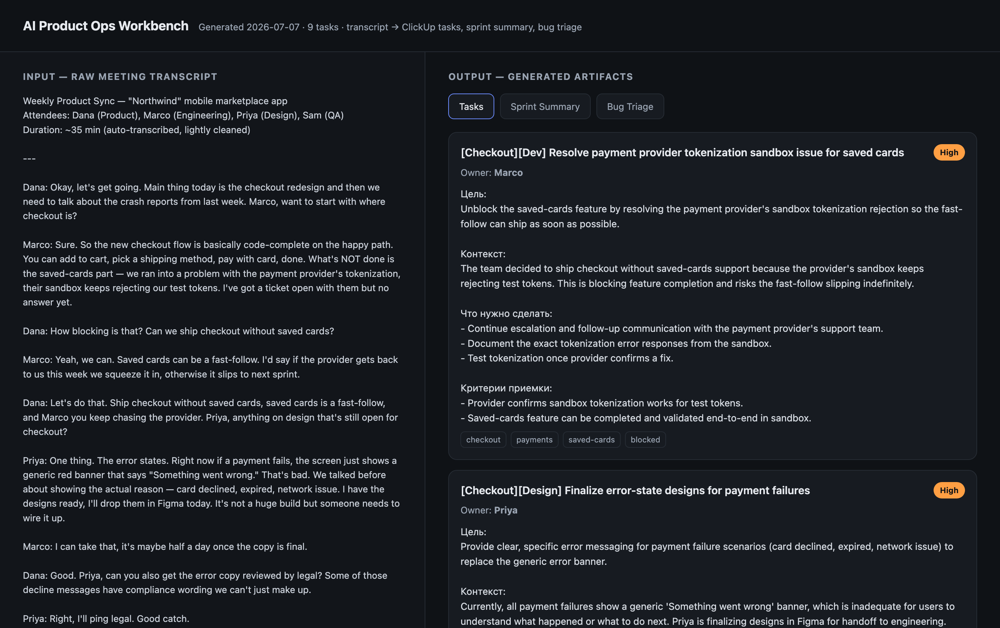

# AI Product Ops Workbench

Turn a messy meeting transcript into the artifacts a product team actually needs —
**ClickUp-ready tasks, a sprint summary, and a bug triage table** — in one command.

### **[▶ Live demo](https://natalie-chmurova.github.io/ai-product-ops-workbench/)** · [📄 Case study](CASE_STUDY.md) · [⚙️ n8n version](https://natalie-chmurova.github.io/ai-product-ops-workbench/n8n-case.html)

[](https://natalie-chmurova.github.io/ai-product-ops-workbench/)

Product teams lose hours turning call recordings and raw notes into structured work.
This tool does the boring part: it reads the transcript, figures out what was decided,
who owns what, and what's broken, then writes the documents for you.

```
transcript.txt  ─►  workbench.py ─►  ┌ tasks.json         (ClickUp-ready)
                                     ├ sprint_summary.md   (stakeholder update)
                                     ├ bug_triage.md       (QA triage table)
                                     └ report.html         (input → output, one page)
```

## How it works

A small three-stage pipeline built on the [Claude API](https://console.anthropic.com):

1. **Understand** — read the raw transcript and extract a clean, structured summary
   (decisions, action items with owners, bugs, risks). One shared summary keeps every
   document consistent.
2. **Build** — turn that summary into the three deliverables, each driven by its own
   prompt so the "product ops logic" is readable and easy to tune.
3. **Present** — render a single self-contained `report.html` showing the raw meeting
   on the left and the generated artifacts on the right. No server, just open it.

Prompts live in [`prompts/`](prompts/) as plain Markdown — the product logic is
first-class and editable without touching code.

**Send to ClickUp (optional):** with a `CLICKUP_API_TOKEN` set, the web app shows a
"Send to ClickUp" button that creates the generated tasks — titled, prioritized, and
tagged — directly in a ClickUp list, so a meeting turns into a populated board in one click.

## Run it

**Web app (point-and-click):**

```bash
pip install -r requirements.txt
cp .env.example .env          # then paste your Anthropic API key into .env
streamlit run app.py          # opens a browser: paste a transcript, click Generate
```

On macOS you can also just double-click `start.command` — it sets up the
environment on first run and launches the app.

**Command line (batch / scripting):**

```bash
python workbench.py samples/transcript_demo.txt   # a transcript...
python workbench.py samples/meeting_demo.m4a       # ...or an audio recording
open outputs/report.html      # macOS ("xdg-open" on Linux)
```

Pass an audio/video file and it is transcribed locally first (mlx-whisper — nothing
leaves the machine, no per-minute API cost), then run through the same pipeline.
A full run over the demo transcript costs a few cents.

## Project layout

```
workbench.py        CLI entry point / orchestrator
src/
  client.py         talks to the Claude API (prompt loading, JSON parsing, retries)
  extract.py        stage 1 — transcript → structured summary
  artifacts.py      stage 2 — summary → tasks / sprint / bug triage
  render.py         stage 3 — artifacts → report.html
prompts/            the instructions for each stage (Markdown)
samples/            a synthetic demo transcript (no real/sensitive data)
outputs/            generated artifacts (git-ignored)
```

## Notes

- The demo transcript is **synthetic** — a fictional team and product, safe to share.
- Task descriptions follow a real ClickUp ticket structure
  (Цель / Контекст / Что нужно сделать / Критерии приемки).
- Built as a portfolio project demonstrating AI-assisted product operations.
