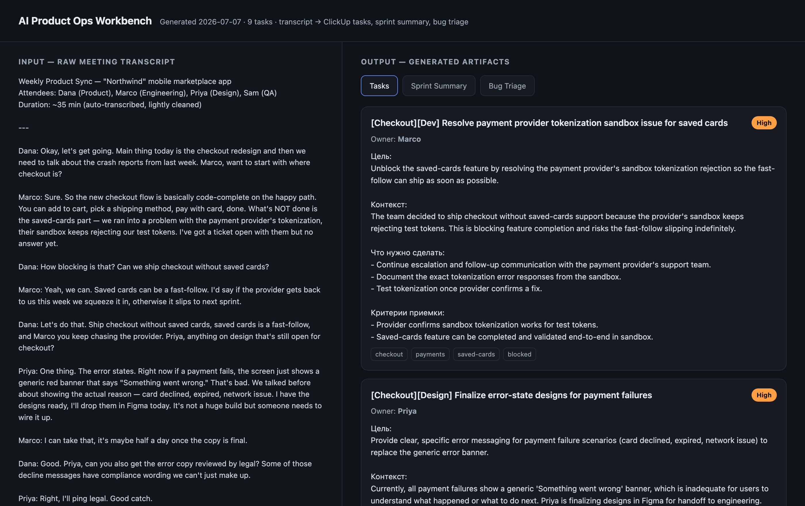

# AI Product Ops Workbench

Turn a messy meeting transcript into the artifacts a product team actually needs —
**ClickUp-ready tasks, a sprint summary, a bug triage table, and a per-speaker
breakdown** — in one command.

### **[▶ Live demo](https://natalie-chmurova.github.io/ai-product-ops-workbench/)** · [📄 Case study](CASE_STUDY.md) · [⚙️ n8n version](https://natalie-chmurova.github.io/ai-product-ops-workbench/n8n-case.html)

[](https://natalie-chmurova.github.io/ai-product-ops-workbench/)

Product teams lose hours turning call recordings and raw notes into structured work.
This tool does the boring part: it reads the transcript, figures out what was decided,
who owns what, and what's broken, then writes the documents for you.

```
transcript.txt  ─►  workbench.py ─►  ┌ tasks.json          (ClickUp-ready)
                                     ├ sprint_summary.md   (stakeholder update)
                                     ├ bug_triage.md       (QA triage table)
                                     ├ speaker_summary.md  (per-person: status, commitments, blockers)
                                     └ report.html         (input → output, one page)
```

## How it works

A small three-stage pipeline built on the [Claude API](https://console.anthropic.com):

1. **Understand** — read the raw transcript and extract a clean, structured summary
   (decisions, action items with owners, bugs, risks). One shared summary keeps every
   document consistent.
2. **Build** — turn that summary into the deliverables, each driven by its own
   prompt so the "product ops logic" is readable and easy to tune. The per-speaker
   view also reads the transcript directly, since who said what is the whole point
   of it — it answers "where is each person, who is stuck", which a thematic
   summary flattens away.
3. **Present** — render a single self-contained `report.html` showing the raw meeting
   on the left and the generated artifacts on the right. No server, just open it.

Prompts live in [`prompts/`](prompts/) as plain Markdown — the product logic is
first-class and editable without touching code.

**Send to ClickUp (optional):** with a `CLICKUP_API_TOKEN` set, the web app shows a
"Send to ClickUp" button that creates the generated tasks — titled, prioritized, tagged,
and **assigned to the resolved owner** — directly in a ClickUp list, so a meeting turns
into a populated board in one click. Owner names resolve to real assignees via an alias
map (`OWNER_ALIASES`) → fuzzy match on workspace members → unassigned fallback.

## Run it

**Web app (point-and-click):**

```bash
pip install -r requirements.txt
cp .env.example .env          # then paste your Anthropic API key into .env
streamlit run app.py          # opens a browser: paste a transcript, click Generate
```

On macOS you can also just double-click `start.command` — it sets up the
environment on first run and launches the app.

**Command line (batch / scripting):**

```bash
python workbench.py samples/transcript_demo.txt   # a transcript...
python workbench.py samples/meeting_demo.m4a       # ...or an audio recording
open outputs/report.html      # macOS ("xdg-open" on Linux)
```

Pass an audio/video file and it is transcribed locally first (mlx-whisper — nothing
leaves the machine, no per-minute API cost), then run through the same pipeline.
A full run over the demo transcript costs a few cents.

## Project layout

```
workbench.py        CLI entry point / orchestrator
src/
  client.py         talks to the Claude API (prompt loading, JSON parsing, retries)
  extract.py        stage 1 — transcript → structured summary
  artifacts.py      stage 2 — summary → tasks / sprint / bug triage / per-speaker
  render.py         stage 3 — artifacts → report.html
  reconcile.py      stage 1.5 — check each point against the board before acting
  clickup.py        reads the board and writes to it
prompts/            the instructions for each stage (Markdown)
samples/            synthetic demo transcripts (no real/sensitive data)
evals/              the three eval harnesses, their labels and their results
outputs/            generated artifacts (git-ignored)
```

## Measuring it

Three harnesses, each answering a different question. All of them run against labels a
delivery manager validated by hand, and all of them are allowed to fail.

| harness | question | latest |
|---|---|---|
| `evals/run_eval.py` | was the work found? | recall 100%, precision 100% on three transcripts |
| `evals/eval_decisions.py` | new work or an update to something that exists? | 100% decision, 100% target |
| `evals/eval_effects.py` | what should actually happen to the board? | 64% / 67% / 50% |

The third is new and deliberately red. Two of the five effects it scores —
`verify_deadline` and `verify_status` — have no implementation at all, so they report
zero on purpose: the metric exists before the feature, so the feature has something to
move.

It also measures what a messy board costs. On the same transcript with the same labels,
a board carrying three duplicate tasks left by old test runs scores **55%** against
**64%** for the same board with the duplicates removed — and the failure is legible:
the agent matches the copy instead of the original and escalates rather than acting.

Two honest caveats, both written into the results files rather than left to be
discovered: effect accuracy folds judgement together with confidence calibration (in
four of ten misses the agent decided exactly what the labels expect and escalated anyway,
below the gate), and the decision eval's ten points do not reach two of the rules its own
prompt now carries.

The effect eval keeps its raw decisions in `evals/effect_decisions.json`. The model call is
the expensive half of that harness and the confidence gate is the cheap one, so asking
where the gate belongs is a re-read rather than another run:

```bash
python evals/eval_effects.py --sweep              # accuracy across gates 0.50-0.95, no API calls
python evals/eval_effects.py --replay --threshold 0.7
```

That matters because calibration is the largest bucket of misses — four of ten — so the
cheapest available experiment is also the one aimed at the biggest share of the failure.
The sweep is still scored against the labels it would be tuned on, so it reports what a
threshold could have bought on this set, not what to set it to.


## The apply gate

The pipeline builds a plan and stops. It writes `outputs/board_plan.md` and never touches
the tracker. That is a decision, not an unfinished feature — and the reason is the shape of
the misses, not the headline number.

### What the 50–67% is actually made of

Ten misses across the three transcripts, and they are three different things:

| bucket | misses | what happened |
|---|---|---|
| calibration | 4 | the agent chose exactly what the labels expect, scored below the 0.8 gate, and escalated anyway |
| no mechanism | 3 | a `verify_deadline` / `verify_status` point with nothing to express it — each landed as a comment on the **right** task (B2, B1, B2) |
| judgement | 3 | the agent genuinely matched the wrong thing |

So **three of ten are real errors of judgement.** Counting the agent's underlying intent
rather than the gated outcome, the same runs read **82% / 83% / 63%**.

Neither number is the honest one alone. Effect accuracy folds judgement together with
confidence calibration, and quoting only the low figure understates the agent as badly as
quoting only the high one would flatter it. The pair is the measurement.

### Why the gate stays closed anyway

- **Three judgement errors in ten is still too many to write into a live board.** The
  calibration misses are safe failures — they escalate to a human. The judgement ones are
  not: they act confidently on the wrong task.
- **Two of the five effects do not exist.** `verify_deadline` and `verify_status` (WB-9,
  WB-18) have no implementation, so a point needing one degrades to a comment. Applying
  now would silently convert "check this date" into "leave a note".
- **On a cluttered board the agent aims at the duplicate.** Not hypothetical: the live
  board carried three duplicate rows from old test runs, and the agent matched the copy
  instead of the original. Idempotency stops the same effect being applied twice; it does
  not stop the correct effect landing on the wrong task.

And the number is probably generous. These transcripts are the ones the extraction and
routing rules were derived from — there is no held-out set. On a meeting the rules have
never seen, expect lower, not higher. Until a held-out transcript exists, 50–67% is a
ceiling estimate rather than a floor.

The gate reopens when WB-9 and WB-18 land and the effect eval is re-run against a
transcript that did not shape the rules.

## Notes

- The demo transcript is **synthetic** — a fictional team and product, safe to share.
- Task descriptions follow a real ClickUp ticket structure
  (Goal / Context / What needs to be done / Acceptance criteria).
- Built as a portfolio project demonstrating AI-assisted product operations.
